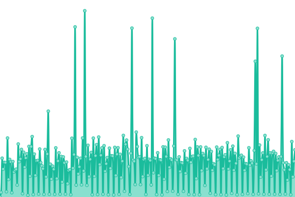

# 💚 LostArk Chinese Forum Status Page | 失落方舟中文论坛站负载状态监测页面

This repository contains the open-source uptime monitor and status page for [White Windmills](https://lost-ark.top/), powered by [Upptime](https://github.com/upptime/upptime).

本仓库包含了由[Upptime](https://uptime.js.org)带来的网站状态侦测服务，通过 GitHub action+Github Pages+Github issue 带来一套**完善**的站点侦测服务，如果网站有停止期报错，异常，会通过 GitHub issue 自动反馈，方便开发组查看。

<!--start: status pages-->
<!-- This summary is generated by Upptime (https://github.com/upptime/upptime) -->
<!-- Do not edit this manually, your changes will be overwritten -->
<!-- prettier-ignore -->
| URL | Status | History | Response Time | Uptime |
| --- | ------ | ------- | ------------- | ------ |
|  [👶 LostArk中文论坛](https://www.google.com) | 🟩 Up | [lost-ark.yml](https://github.com/white-windmills/lostark-status/commits/HEAD/history/lost-ark.yml) | 

 1027ms
     
 | 

<a href="https://status.lost-ark.top/history/lost-ark">100.00%</a>
    

|  [🚵‍♂️ LostArk地图](https://lost-ark.top/map/) | 🟩 Up | [lost-ark.yml](https://github.com/white-windmills/lostark-status/commits/HEAD/history/lost-ark.yml) | 

 1027ms
     
 | 

<a href="https://status.lost-ark.top/history/lost-ark">100.00%</a>
    

|  [🎎 LostArk活动看板](https://timer.lost-ark.top/zh/alarms) | 🟩 Up | [lost-ark.yml](https://github.com/white-windmills/lostark-status/commits/HEAD/history/lost-ark.yml) | 

 1027ms
     
 | 

<a href="https://status.lost-ark.top/history/lost-ark">100.00%</a>
    

|  [✨ LostArk好感度看板](https://lost-ark.top/affinity/) | 🟩 Up | [lost-ark.yml](https://github.com/white-windmills/lostark-status/commits/HEAD/history/lost-ark.yml) | 

 1027ms
     
 | 

<a href="https://status.lost-ark.top/history/lost-ark">100.00%</a>
    

|  [🥽 LostArk伤害计算器](http://upgrade.lost-ark.top/) | 🟩 Up | [lost-ark.yml](https://github.com/white-windmills/lostark-status/commits/HEAD/history/lost-ark.yml) | 

 1027ms
     
 | 

<a href="https://status.lost-ark.top/history/lost-ark">100.00%</a>
    

<!--end: status pages-->
