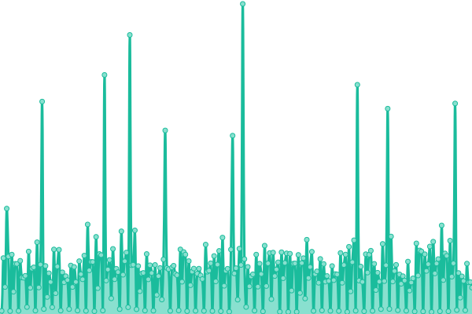

# 💚 LostArk Chinese Forum Status Page | 失落方舟中文论坛站负载状态监测页面

This repository contains the open-source uptime monitor and status page for [White Windmills](https://lost-ark.top/), powered by [Upptime](https://github.com/upptime/upptime).

With [Upptime](https://upptime.js.org), you can get your own unlimited and free uptime monitor and status page, powered entirely by a GitHub repository. We use [Issues](https://github.com/white-windmills/lostark-status/issues) as incident reports, [Actions](https://github.com/white-windmills/lostark-status/actions) as uptime monitors, and [Pages](https://white-windmills.github.io/lostark-status) for the status page.

<!--start: status pages-->
<!-- This summary is generated by Upptime (https://github.com/upptime/upptime) -->
<!-- Do not edit this manually, your changes will be overwritten -->
<!-- prettier-ignore -->
| URL | Status | History | Response Time | Uptime |
| --- | ------ | ------- | ------------- | ------ |
|  [👶 LostArk中文论坛](https://www.google.com) | 🟩 Up | [lost-ark.yml](https://github.com/white-windmills/lostark-status/commits/HEAD/history/lost-ark.yml) | 

 2863ms
     
 | 

<a href="https://white-windmills.github.io/lostark-status/history/lost-ark">100.00%</a>
    

|  [🚵‍♂️ LostArk地图](https://lost-ark.top/map/) | 🟩 Up | [lost-ark.yml](https://github.com/white-windmills/lostark-status/commits/HEAD/history/lost-ark.yml) | 

 2863ms
     
 | 

<a href="https://white-windmills.github.io/lostark-status/history/lost-ark">100.00%</a>
    

|  [🎎 LostArk活动看板](https://timer.lost-ark.top/zh/alarms) | 🟩 Up | [lost-ark.yml](https://github.com/white-windmills/lostark-status/commits/HEAD/history/lost-ark.yml) | 

 2863ms
     
 | 

<a href="https://white-windmills.github.io/lostark-status/history/lost-ark">100.00%</a>
    

|  [✨ LostArk好感度看板](https://lost-ark.top/affinity/) | 🟩 Up | [lost-ark.yml](https://github.com/white-windmills/lostark-status/commits/HEAD/history/lost-ark.yml) | 

 2863ms
     
 | 

<a href="https://white-windmills.github.io/lostark-status/history/lost-ark">100.00%</a>
    

<!--end: status pages-->
